# Занятие 2 · Пошаговая инструкция к практике

ОП.03 «Информационные технологии», 2 курс. Тема — **UTM-метки: определяем источник
перехода и заявки**.

Инструкция рассчитана на самостоятельную работу: каждый шаг говорит, что нажать и
что должно получиться. После каждого шага есть кадр — сверяйтесь с ним. Если у вас
получилось иначе, не идите дальше: в конце файла есть таблица «что пошло не так».

**Что понадобится:** браузер Chrome (или любой на его основе), учебный стенд из
папки занятия, текстовый редактор для файла отчёта.

**Что сдаёте:** файл `lesson_03/utm_links.md` в ветке `hw-03`. Шаблон — в части 7.

**Правило про данные:** в форму вводим только тестовые значения — условное имя,
учебный адрес почты, слово «проверка» в комментарии. Настоящие персональные данные
не вводим никуда, даже свои.

---

## Часть 0. Запустить стенд

Стенд лежит в папке занятия: `op03-informacionnye-tehnologii/lessons/03-utm-metki/stend/`.

**Шаг 0.1.** Открыть терминал в папке `stend` и выполнить:

```bash
python3 serve.py
```

Команда не завершится — так и должно быть, сервер работает, пока окно открыто.
Закрыть его в конце: `Ctrl + C`. Если порт 8000 занят, укажите другой:
`python3 serve.py 8080`.

**Шаг 0.2.** Открыть в браузере <http://localhost:8000/>

**Должно получиться:** страница курса «Веб-аналитика с нуля» с кнопкой «Оставить
заявку».

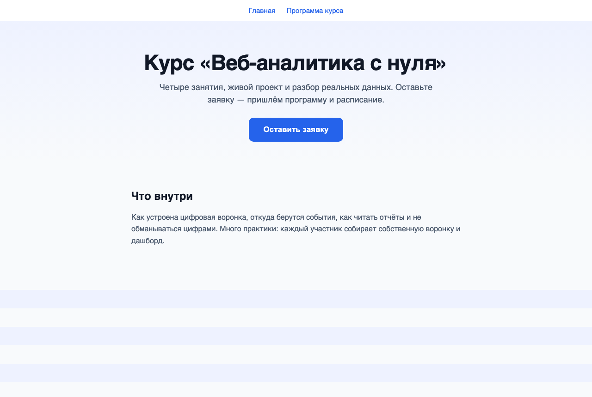

> **Почему через сервер, а не двойным щелчком по файлу.** Если открыть
> `index.html` как файл, запросы уйдут на настоящий адрес `google-analytics.com`
> и без интернета не дойдут. `serve.py` принимает их сам и отвечает так же, как
> настоящий сервер аналитики, — кодом `204 No Content`. Строки в панели Network
> будут зелёными, а в терминале появятся имена отправленных событий.
>
> **Если запускаете стенд иначе** — через Live Server в VS Code, через
> `python3 -m http.server` или другой статический сервер, — строки `collect` будут
> красными: эти серверы адреса `/g/collect` не знают и отвечают `404` или `405`.
> **Разбору это не мешает.** Запрос браузер сформировал, и все параметры читаются
> на вкладке Payload при любом коде ответа — а нам нужны именно они.

---

## Часть 1. Быстрая практика (7 минут)

Цель этой части — увидеть результат до того, как разбираться в теории.

### Шаг 1.1. Отправить форму как есть

Пролистать страницу до формы «Оставить заявку». Заполнить поля тестовыми данными и
нажать «Отправить».

**Должно получиться:** блок «Заявка сохранена», в котором три поля источника имеют
значение `(not set)`.

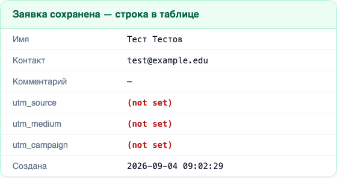

Заявка полноценная: имя и контакт на месте, с человеком можно связаться. Неизвестно
только одно — откуда он пришёл.

### Шаг 1.2. Дописать в адрес три пары

Щёлкнуть по адресной строке браузера, поставить курсор **в самый конец** адреса и
дописать одной строкой, без пробелов:

```
?utm_source=vk&utm_medium=social&utm_campaign=sept_open_2026
```

Нажать `Enter`.

**Должно получиться:** адресная строка выглядит так (номер порта у вас будет свой).

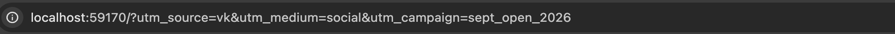

Страница при этом не изменилась: тот же заголовок, та же кнопка, та же форма.

### Шаг 1.3. Сравнить строку под формой

Пролистать до формы. Под ней есть учебная строка, показывающая, что лежит в скрытых
полях формы.

**Должно получиться:** слева — то, что было до дописывания, справа — то, что стало.

| до | после |
|---|---|
| 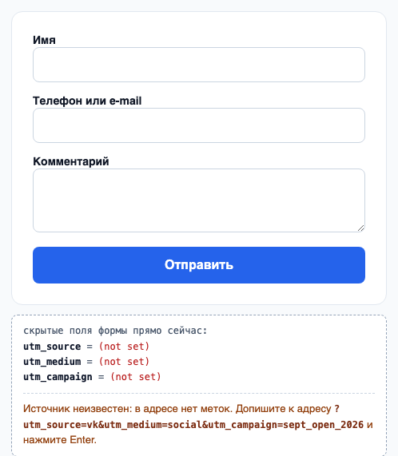 | 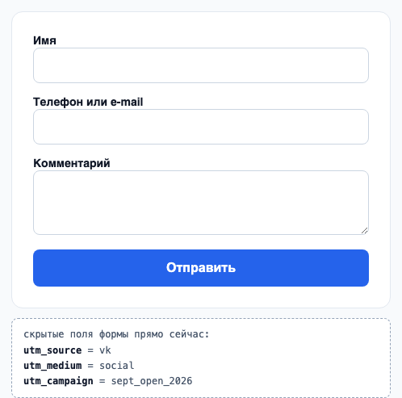 |

Ни одно из этих трёх полей вы не заполняли: значения появились сами при загрузке
страницы, их взял из адреса код стенда.

> Такой строки на настоящем сайте нет — она добавлена в учебный стенд, чтобы
> разметку было видно до отправки формы, а не только в панели Network.

### Шаг 1.4. Отправить форму ещё раз

Заполнить и отправить форму повторно.

**Должно получиться:** та же таблица заявки, но теперь с источником.

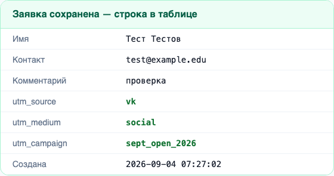

Сравните с кадром из шага 1.1. Разница между двумя строками — единственное, чего вы
добились дописыванием трёх пар. Ни форма, ни страница, ни код сайта при этом не
менялись.

### Шаг 1.5. Найти те же значения в запросе

Открыть инструменты разработчика: `F12` (Windows, Linux) или `Cmd + Option + I`
(macOS). Перейти на вкладку **Network**, в поле **Filter** ввести `collect`.
Отправить форму ещё раз, выбрать в списке строку `collect` и открыть вкладку
**Payload**.

**Должно получиться:** три знакомых значения среди полей запроса.

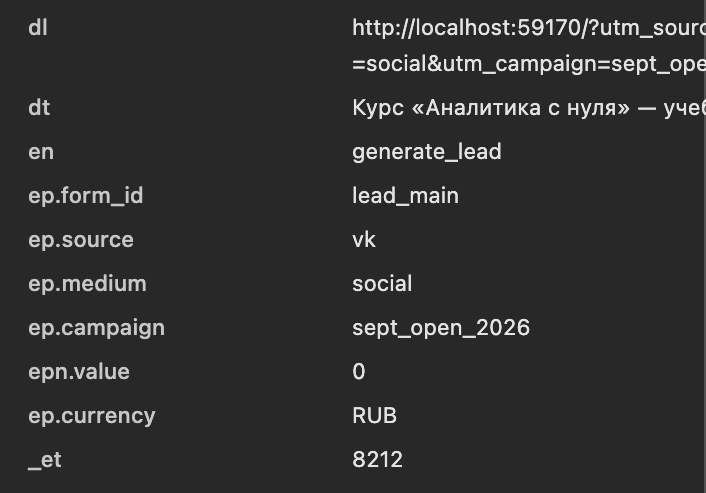

Итог первой части: **одна надпись, сделанная руками в адресной строке, дошла до двух
разных мест** — до строки заявки и до поля события. Дальше на паре разбираем, почему
это работает; ниже — основная работа.

---

## Часть 2. Настроить панель Network один раз

Дальше панель понадобится на каждом шаге, поэтому настроим её как следует.

**Шаг 2.1.** `F12` или `Cmd + Option + I` → вкладка **Network**.

**Шаг 2.2.** В поле **Filter** ввести `collect` — в списке останутся только запросы
к системе аналитики.

**Шаг 2.3.** Поставить галочку **Preserve log** — список не будет очищаться при
переходах между страницами. Без неё вы потеряете запросы после каждой перезагрузки.

**Должно получиться:**

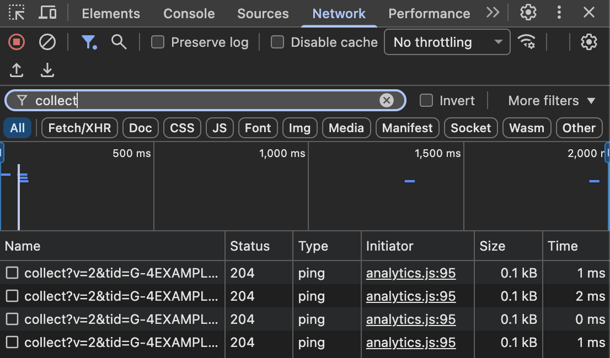

Что означают столбцы (разбирали на занятии 1): **Name** — адрес запроса,
**Status 204** — «принято, тела ответа нет», **Type ping** — запрос ушёл через
`sendBeacon`, **Size 0.1 kB** — улетела только строка параметров.

---

## Часть 3. Составить справочник и собрать ссылки

### Шаг 3.1. Заполнить справочник (8 минут)

Придумайте учебную кампанию и четыре канала, по которым её продвигаете. Для каждого
канала подберите три значения — по шести правилам:

1. только строчные буквы;
2. только латиница;
3. `_` вместо пробела;
4. `utm_medium` — из списка: `organic`, `cpc`, `email`, `social`, `referral`,
   `affiliate` (для QR-кодов договорились писать `qr`);
5. в `utm_campaign` — повод и период;
6. ссылка собирается из справочника, а не по памяти.

Образец — заполните своими значениями:

| Канал | `utm_source` | `utm_medium` | `utm_campaign` |
|---|---|---|---|
| Пост в сообществе колледжа | `vk` | `social` | `sept_open_2026` |
| Рассылка приёмной комиссии | `priem_email` | `email` | `sept_open_2026` |
| QR-код на печатной афише | `afisha_qr` | `qr` | `sept_open_2026` |
| Ссылка со страницы партнёра | `partner_site` | `referral` | `sept_open_2026` |

Столбец `utm_campaign` у всех четырёх строк **одинаковый**: это одна кампания,
доставленная четырьмя способами. Различают каналы первые два столбца.

### Шаг 3.2. Собрать четыре ссылки (7 минут)

Каждая ссылка — это адрес стенда плюс довесок из своей строки справочника:

```
http://localhost:8000/?utm_source=ЗНАЧЕНИЕ&utm_medium=ЗНАЧЕНИЕ&utm_campaign=ЗНАЧЕНИЕ
```

Проверьте по схеме: один знак `?`, дальше между парами только `&`.

```
http://localhost:8000/?utm_source=vk&utm_medium=social&utm_campaign=sept_open_2026
                      │           │ │                │
                      │           │ │                └ третья пара
                      │           │ └ разделитель пар
                      │           └ разделитель имени и значения
                      └ начало строки запроса, ставится один раз
```

Запишите все четыре ссылки в файл отчёта **целиком** — не «как в третьей строке
таблицы», а полным текстом. Их потом нужно будет открыть.

---

## Часть 4. Проверить каждую ссылку (8 минут)

Повторите для каждой из четырёх ссылок.

**Шаг 4.1.** Вставить ссылку в адресную строку, нажать `Enter`.

**Шаг 4.2.** Прочитать адрес глазами. Проверяем три вещи:

- метки на месте и не пропали при переходе;
- один `?` в начале довеска, дальше только `&`;
- нет `%20` и последовательностей `%D0%…`.

**Шаг 4.3.** Пролистать до формы и посмотреть на строку скрытых полей — там должны
быть ваши значения, а не `(not set)`.

**Шаг 4.4.** Заполнить и отправить форму. Снять кадр блока «Заявка сохранена».

**Шаг 4.5.** В панели Network выбрать строку `collect` с событием `generate_lead` и
открыть **Payload**. Найти три поля и записать их значения в таблицу отчёта.

**Должно получиться** (значения будут ваши):


Таблица для отчёта:

| № | Канал | `ep.source` | `ep.medium` | `ep.campaign` | Поля в заявке заполнены? |
|---|---|---|---|---|---|
| 1 | | | | | |
| 2 | | | | | |
| 3 | | | | | |
| 4 | | | | | |

> **Как найти нужную строку среди нескольких.** При загрузке страницы уходит
> `page_view`, при прокрутке — `scroll`, при первом щелчке по форме — `form_start`,
> при отправке — `generate_lead`. Нужна последняя. Имя события видно в поле `en` на
> вкладке Payload.

---

## Часть 5. Сломать ссылку намеренно (5 минут)

Возьмите пятую ссылку и испортите её **одним** способом из списка:

| Способ | Что дописать вместо правильного значения |
|---|---|
| регистр | `utm_source=VK` вместо `vk` |
| пробел | `utm_campaign=sept open` вместо `sept_open_2026` |
| кириллица | `utm_campaign=Сентябрь` |
| опечатка в имени | `utm_sourse=vk` вместо `utm_source=vk` |
| второй знак «?» | `utm_medium=social?utm_campaign=sept_open_2026` |
| метка после решётки | `#utm_source=vk` вместо `?utm_source=vk` |

Откройте испорченную ссылку и пройдите те же шаги 4.1–4.5.

**Пример, как это выглядит** — здесь сломано сразу тремя способами (прописные буквы,
пробелы, кириллица):

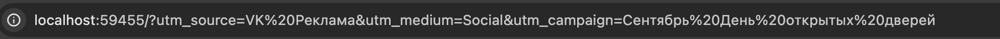

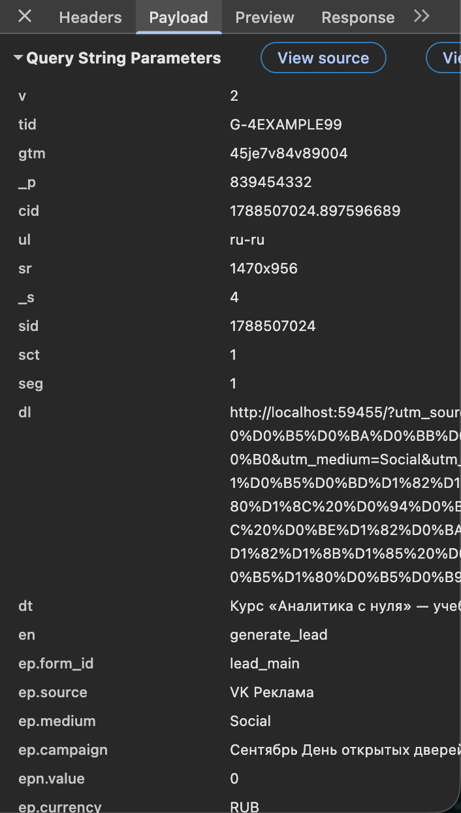

Обратите внимание на поле `dl`: адрес разбух, каждая русская буква записана тремя
символами вида `%D0%B5`. А в `ep.source` вкладка Payload показывает исходную
строку — `VK Реклама`, с пробелом и прописными буквами.

**Запишите в отчёт:**

| Что испортили | Что изменилось в полях `ep.*` | Как это выглядело бы в отчёте |
|---|---|---|
| | | |

Третий столбец — самый важный. Например: «значение `VK` не совпадёт с `vk`, и в
отчёте появится вторая строка по тому же сообществу» или «метки `utm_campaign` в
запросе не будет вовсе, кампанию в отчёте не найти».

---

## Часть 6. Проверить переход вглубь сайта

Это самый частый случай потери источника на настоящих сайтах: человек приходит по
размеченной ссылке на главную, а форму заполняет на другой странице.

**Шаг 6.1.** Открыть стенд по любой из своих размеченных ссылок.

**Шаг 6.2.** В меню сверху нажать «Программа курса».

**Шаг 6.3.** Посмотреть на адресную строку.

**Должно получиться:** меток в адресе больше нет — переход был по обычной ссылке из
меню.

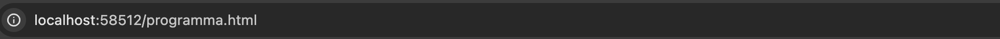

**Шаг 6.4.** Пролистать до формы на этой странице и посмотреть на строку скрытых
полей.

**Должно получиться:** значения источника **сохранились**, хотя в адресе их нет.

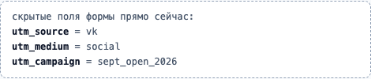

Так работает **первое касание**: стенд запомнил метки при первом заходе и
подставляет их дальше. Если бы этого не было, заявка с внутренней страницы потеряла
бы источник.

---

## Часть 7. Что сдать

Файл `lesson_03/utm_links.md`, ветка `hw-03`, запрос на слияние в собственную ветку
`main`. Шаблон:

```markdown
# Занятие 2. UTM-разметка

## 1. Справочник меток
| Канал | utm_source | utm_medium | utm_campaign |
|---|---|---|---|
| … | … | … | … |

## 2. Собранные ссылки
1. Канал — полный адрес
2. …

## 3. Проверка
| № | ep.source | ep.medium | ep.campaign | Поля в заявке |
|---|---|---|---|---|
| 1 | … | … | … | да / нет |

Кадры сохранённых заявок: четыре файла в папке `img/`.

## 4. Намеренная поломка
Что испортили: …
Что изменилось в ep.*: …
Как это выглядело бы в отчёте: …
```

**Приёмка:** справочник и четыре ссылки — к концу пары, остальное — с домашним
заданием.

**Контрольный вопрос:** показать в Payload собственное событие и назвать, из какой
части адреса взялось значение `ep.source`.

---

## Что пошло не так

| Что видите | Причина | Что делать |
|---|---|---|
| Открывается пустая страница или `404` | перед первой меткой стоит `/` вместо `?` | заменить на `?`: метки идут после `?`, а не отдельным путём |
| Строка `collect` красная, код `404` | сервер не обслуживает адрес `/g/collect` | ничего: параметры на вкладке Payload читаются полностью. Чтобы строки были зелёными, запустить `python3 serve.py` |
| Строка `collect` красная, код `405 Method Not Allowed` | Live Server и подобные статические серверы не принимают `POST`, а `sendBeacon` шлёт именно его | то же самое: параметры читаются полностью. Для зелёных строк — `python3 serve.py` |
| Строк `collect` нет вообще | не введён фильтр, либо страница загрузилась до открытия панели | ввести `collect` в поле Filter и перезагрузить страницу |
| Строки исчезают при переходе | не включён **Preserve log** | поставить галочку, повторить шаги |
| `(failed) ERR_BLOCKED_BY_CLIENT` | блокировщик рекламы или расширение приватности | отключить блокировщик для этой вкладки |
| В скрытых полях `(not set)`, хотя метка в адресе есть | опечатка в **имени** метки (`utm_sourse`) или метка стоит после `#` | сверить имя посимвольно; метки идут после `?` и до `#` |
| В адресной строке `%20` или `%D0%…` | в значении остались пробел или кириллица | переписать значение латиницей, слова разделить `_` |
| Метки пропали после `Enter` | довесок дописан не в конец адреса, а внутрь | поставить курсор в самый конец и повторить |
| Значение `ep.campaign` содержит кусок соседней метки | вместо `&` написан второй `?` | заменить на `&` |
| Порт `8000` занят | на нём уже что-то работает | запустить `python3 serve.py 8001` и открыть тот же порт в браузере |

---

**Полный конспект занятия** — `LESSON.md` в этой же папке.
**Как устроен стенд и что он умеет** — `stend/README.md`.
